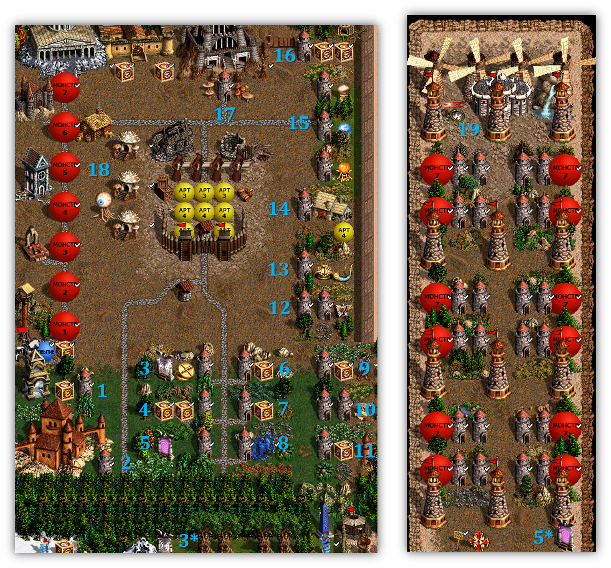
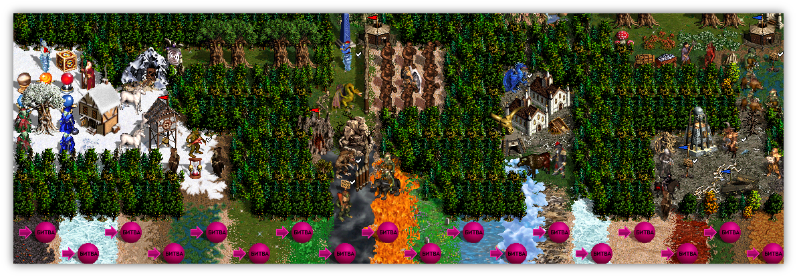

## Lucktest Advanced 2.0 (Double Bird, Light Version)

### Описание карты

- Тип: Арена. При удерживании ПКМ на объектах, вы увидите содержимое ящиков Пандоры.
- Сражение большими армиями (масштаб - 110 существ седьмого уровня)
- На старте вам выдаются две Птицы Восприятия. Птица - ключ к бонусному усилению за вратами задания.
- Обязательно используйте Форт на Холме, чтобы улучшить существ. Если вам не хватает денег, то продайте ресурсы на внешнем рынке около форта.
- Не забудьте пополнить ману в колодце. Передайте ход и дождитесь оппонента, битва начнётся автоматически на случайной местности.

Версия под новый патч, который усилил ранее слабые навыки.

### Пояснение к бонусам за Птицу Восприятия

При подходе к вратам задания, вы увидите сообщение в игре, что за ним скрывается. Данный список является выжимкой всех нюансов карты.
Так как параметры ящиков Пандоры можно увидеть непосредственно в игре, то остановимся только на неочевидных моментах.
1. Храм Примирения (все юниты становятся одной фракции, +1 мораль).
2. Утопия Драконов **максимального** размера.
3. Кольцо на +1 Скорости и 4 дерева, повышающих уровень героя. Полезно, если вам необходимо докачать навык, но вы не можете жертвовать артефакты/существ.
4. Увеличение Атаки и удачи.
5. Портал, который ведет вас на Рынок существ 7 уровня. Чтобы увидеть его, откройте **подземную** карту мира в игре (правая половина изображения выше). Подберите Символ Знаний и обменяйте ваше существо 7 уровня на выпавшее вам. Какой юнит требуется можно посмотреть, если удерживать ПКМ на Вратах Задания. Более того, вы получите 135 существ 7 уровня вместо 110, получите возможность удвоить ману и посетить флаг +1 морали и +1 удачи (19).
6. Снайперы в вашей армии и артефакт.
7. Чародеи в вашей армии и артефакт.
8. Лазурные драконы в вашей армии.
9. Присоединить крестьян (их количество можно уточнить заклинанием Видение, которое выдается вам на старте карты, сейчас их 3000) и пригласить их в Преобразователь скелетов, сделав ударный стек из существ 1 уровня. Ящик на +2 боевого духа компенсирует нежить в вашей армии.
10. Свиток Берсерка, но придётся потратить две Птицы.
11. Ящик Пандоры на значительную прибавку к Силе магии, Знание и Голову легиона, которая открывает доступ к сферам стихий (15). Играть от боевой магии без этой коробки в большинстве случаев бесполезно.
12. Железный Кулак Огра, нужно потратить две Птицы.
13. Рог Бездны (призыв Фангармов при смерти стека) и всегда Кольцо на +1 ОЗ.
14. Фабрика Военных Машин - Баллиста, Палатка, Тележка с боеприпасами. Добавлено в связи с улучшением навыка Первой Помощи. Остальные военные машины послужат неплохой защитой для ваших юнитов. Также вы получите артефакт-реликт, однако учтите, что он виден вашему оппоненту, равно как и вы видите его артефакт за этот бонус.
15. Описано в пункте 11. Открывается за Голову Легиона.
16. Хижина Провидца, обеспечивающая разведку зоны оппонента. Вы увидите его артефакты на открытой местности и состав армии. Также ящик Пандоры на Экспертный Орлиный глаз и Экспертную Магию Воды.
17. Удвоение маны, Гильдия магов с 1 по 4 уровень, **Торговцы артефактами**. Напоминаю, что в Подземелье не может выпасть заклинание Молитва.
18. Если вам выпали стальные, золотые или алмазные големы, воспользуйтесь этими хижинами провидца. Вы обменяете их на Сказочных, Ржавых и Кристальных драконов соответственно.

#### Локации сражений

Остальная часть карты не несёт смысловой нагрузки и имеет только комедийный эффект.
   
